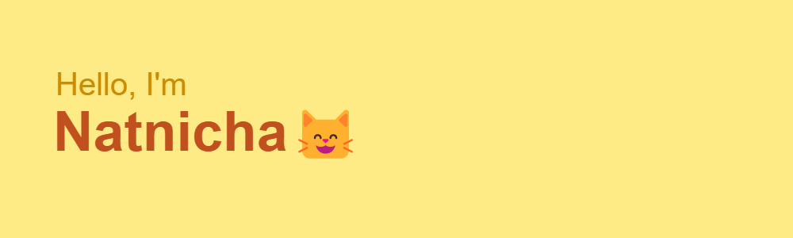

## Hi there 👋
 You can call me pin, I'm currently a fourth-year Information Technology major. I am passionately determined to discover and learn new things.
 <h3> 🖥️ Languages </h3>
  
 
 
 
 
 
 
 
 
 
 	

  <h3> 🎈 Frameworks / Library  </h3>
   
  
 
 
 
 
 
 
 

  <h3> 🎈 Codewars & leetcode  </h3>
    
  - https://www.codewars.com/users/natnichapin  
  - https://leetcode.com/natnichapin/

    
  
<h3> :atom: My other talents </h3>
 
 

  🗾 Japanese language: Level N5 ------------
  🖼️ drawing ------------
  😗 Sing a song

   
  <h3> 😲 Social Media  </h3>
  
 

  

 ## GIT HUB STATS
  &emsp;&emsp;
  
    
 > <h3>Keep going and don't give up</h3> 
 
 🐹Thank you for reading.
 <!--
**natnichapin/natnichapin** is a ✨ _special_ ✨ repository because its `README.md` (this file) appears on your GitHub profile.

Here are some ideas to get you started:

- 🔭 I’m currently working on ...
- 🌱 I’m currently learning ...
- 👯 I’m looking to collaborate on ...
- 🤔 I’m looking for help with ...
- 💬 Ask me about ...
- 📫 How to reach me: ...
- 😄 Pronouns: ...
- ⚡ Fun fact: ...
-->
